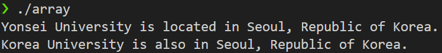
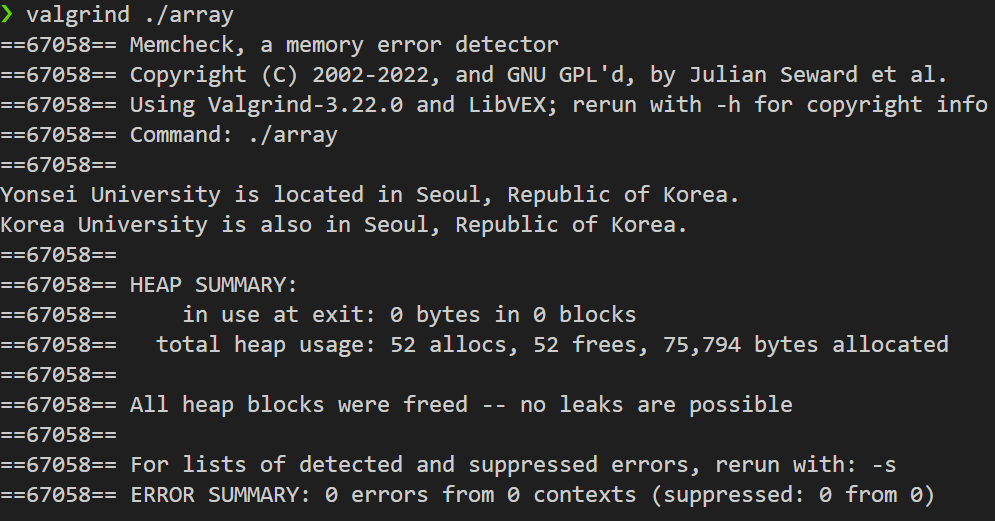

# HW1: Custom Dynamic Array Implementation (array_t)

## 1. 문제 정의 (Problem Definition)

본 프로젝트는 C++의 기본 개념(생성자, 소멸자, 동적 메모리 할당)을 활용하여 표준 라이브러리 `std::vector`와 유사하게 크기가 동적으로 조절되는(Resizable) 커스텀 배열 컨테이너 **`array_t`** 클래스를 구현하는 것입니다.

특히, 배열 요소로 복잡한 타입인 `string_t` 클래스를 사용하여, 클래스 인스턴스를 담는 컨테이너에서 발생하는 **깊은 복사(Deep Copy)** 문제를 해결하고 메모리 안정성을 확보하는 것이 핵심 요구사항이었습니다.

## 2. 구현 전략 (Implementation Strategy)

이 프로젝트는 Modern C++의 `new/delete`가 아닌 C-스타일의 `malloc/free`를 사용하여 Raw Memory를 직접 관리해야 하는 고난이도 제약 조건을 포함했습니다.

1.  **깊은 복사:** `array_t`의 **복사 생성자**는 얕은 복사로 인한 이중 해제(Double Free)를 방지하기 위해, 원본 객체의 요소들을 `data_t`의 복사 생성자를 명시적으로 호출하는 **배치 생성자 (Placement New)**를 통해 새로운 메모리 공간에 깊은 복사하도록 설계했습니다.
2.  **객체 생명주기 관리:**
    * `reserve()` 및 **소멸자**에서는 `malloc`으로 할당된 메모리를 `free`하기 전에, 해당 메모리 내에 존재하는 모든 `data_t` 인스턴스에 대해 **명시적 소멸자 호출 (`ptr[i].~data_t()`)**을 수행하여 객체 생명주기를 안전하게 파괴했습니다.
    * `push_back()`에서는 공간 부족 시 메모리를 2배로 확장하는 전략(Doubling Policy)을 적용하고, 새 요소를 추가할 때 배치 생성자를 사용했습니다.
3.  **안전성:** 모든 동적 메모리 할당 및 해제 로직을 엄격하게 관리하여, `valgrind` 검증을 통해 **메모리 누수(Memory Leak) 0**을 달성했습니다.

## 3. 결과 (Results)

구현된 `array_t` 클래스는 데이터 추가 및 복사 생성자 호출 후에도 데이터 무결성이 유지되었으며, 모든 동적 할당 메모리가 성공적으로 해제되었습니다.

| 명령어 | 결과 |
| :--- | :--- |
| **`./array` 실행 결과** | 데이터 무결성 확인 및 예상 출력 일치 |
| **`valgrind ./array` 검증 결과** | **`All heap blocks were freed -- no leaks are possible`** |

### 실행 결과 및 메모리 검증 스크린샷

#### 1. 프로그램 실행 결과 (Data Integrity)

#### 2. Valgrind 메모리 검증 결과 (Memory Safety)

## 4. 기술적 성과 (Technical Accomplishment)

* **Custom Container 구현:** Raw Memory(`malloc/free`)를 활용하여 STL `vector`의 핵심 기능(Capacity/Size 관리, Dynamic Resizing)을 재현했습니다.
* **객체 생명주기 제어:** `data_t` 클래스 인스턴스에 대해 **Placement New**와 **명시적 소멸자 호출**이라는 C++ 고급 기법을 적용하여, C-스타일 메모리 환경에서 객체 생명주기를 완벽하게 제어하는 데 성공했습니다.
* **메모리 안정성 보장:** `valgrind` 검증을 통해 **깊은 복사 구현의 정확성과 메모리 누수 제로**를 입증하여, 해당 컨테이너의 높은 안정성을 확보했습니다.