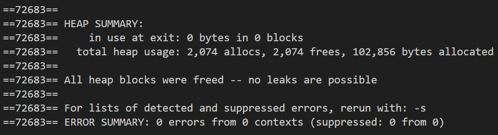

# HW2: Generic Dynamic Array with C++ Templates (vector_t)

## 1. 문제 정의 (Problem Definition)

본 프로젝트의 목표는 C++ **템플릿(Template)**을 활용하여 범용적인 데이터 타입을 저장할 수 있는 동적 배열 컨테이너 **`vector_t<T>`**를 구현하는 것입니다.

단순한 데이터 저장을 넘어, `malloc`/`free`를 이용한 Raw Memory 관리와 `Placement New`/`Explicit Destructor`를 이용한 객체 생명주기 관리를 결합하여, STL `std::vector`의 내부 동작 원리를 모사하고 메모리 효율성과 안정성을 확보해야 합니다.

## 2. 구현 전략 (Implementation Strategy)

이 프로젝트는 Type-Agnostic한 컨테이너를 구현하기 위해 다음과 같은 전략을 수립했습니다.

1.  **Raw Memory Management:**
    * `new[]` 연산자 대신 `malloc`을 사용하여 메모리 할당과 객체 생성을 분리했습니다. 이는 불필요한 Default Constructor 호출을 막고 메모리 효율을 높입니다.
2.  **Object Lifecycle Control:**
    * **생성:** 할당된 Raw Memory에 `Placement New`를 사용하여 요소를 복사 생성합니다.
    * **소멸:** `clear`, `pop_back`, `erase` 등에서 메모리를 해제하기 전, 반드시 명시적 소멸자(`ptr->~T()`)를 호출하여 객체 리소스를 정리합니다.
3.  **Deep Copy & Self-Assignment Safety:**
    * 복사 생성자와 대입 연산자(`operator=`) 구현 시, 단순 포인터 복사가 아닌 요소별 깊은 복사를 수행했습니다.
    * 특히 대입 연산자에서는 **Self-Assignment(자기 할당)** 검사를 통해 불필요한 연산과 데이터 손실을 방지했습니다.
4.  **Iterator Support:**
    * `insert`와 `erase` 연산 시 이터레이터를 기반으로 요소를 이동(Shift)시키고, 연산 후 유효한 이터레이터를 반환하여 **Iterator Invalidation** 문제를 방지했습니다.

## 3. 결과 (Results)

구현된 `vector_t`는 대량의 데이터 삽입, 삭제, 정렬 시나리오에서도 정확하게 동작했으며, Valgrind 검증 결과 메모리 누수가 전혀 발생하지 않았습니다.

### 3.1 실행 로그 (Execution Log)

<details>
<summary> 클릭하여 실행 결과 확인 (Click to expand)</summary>

```text
capacity()=128
size()=80
array=[ irony muscle trait voter year equation chorus denial temple horror zebra satellite uniform toss personality quartz vitamin candidate grand octopus ladder zone name density jam attention ankle thumb symptom railroad shelf glass origin emphasis matter dozen diplomatic notch perceive leaf rocket jelly unrest hen rear imagine knob yearn legislature begin negotiation frequency quarter bedroom enter ribbon evaluate instinct write obstacle zoo gift shelter fresh feast unicorn bare vase admire cage night encourage turkey prosper habitat kite xylophone multiply wrestle profile ]

capacity()=128
size()=63
array=[ muscle trait voter year chorus denial temple horror zebra satellite toss personality quartz vitamin candidate grand ladder zone name density jam thumb symptom railroad shelf glass matter dozen diplomatic notch perceive leaf rocket jelly hen rear knob yearn legislature begin negotiation frequency quarter bedroom ribbon write zoo gift shelter fresh feast bare vase cage night turkey prosper habitat kite xylophone multiply wrestle profile ]

capacity()=63
size()=63
array=[ bare bedroom begin cage candidate chorus denial density diplomatic dozen feast frequency fresh gift glass grand habitat hen horror jam jelly kite knob ladder leaf legislature matter multiply muscle name negotiation night notch perceive personality profile prosper quarter quartz railroad rear ribbon rocket satellite shelf shelter symptom temple thumb toss trait turkey vase vitamin voter wrestle write xylophone year yearn zebra zone zoo ]

capacity()=63
size()=60
array=[ bare bedroom begin cage candidate chorus denial density diplomatic dozen feast frequency fresh gift glass grand habitat hen horror jam jelly kite knob ladder leaf legislature matter multiply muscle name negotiation night notch perceive personality profile prosper quarter quartz railroad rear ribbon rocket satellite shelf shelter symptom temple thumb toss trait turkey vase vitamin voter wrestle write xylophone year yearn ]

capacity()=63
size()=0
array=[ ]

capacity()=128
size()=0
array=[ ]
```
</details>

### 3.2 메모리 검증 (Memory Verification)

Valgrind를 통해 힙 메모리 사용을 추적한 결과, 모든 블록이 정상적으로 해제되었음을 확인했습니다.



## 4. 기술적 성과 (Technical Accomplishment)

* **Generic Container:** 템플릿을 사용하여 `int`, `string` 등 다양한 타입을 지원하는 범용 컨테이너를 설계했습니다.
* **Advanced Memory Handling:** C-style의 메모리 할당과 C++의 객체 모델을 결합하여, `std::vector`와 유사한 수준의 세밀한 메모리 제어 능력을 입증했습니다.
* **Robustness:** `valgrind` 검증을 통해 복잡한 재할당 과정에서도 **Memory Leak 0**를 달성하여 코드의 안정성을 증명했습니다.