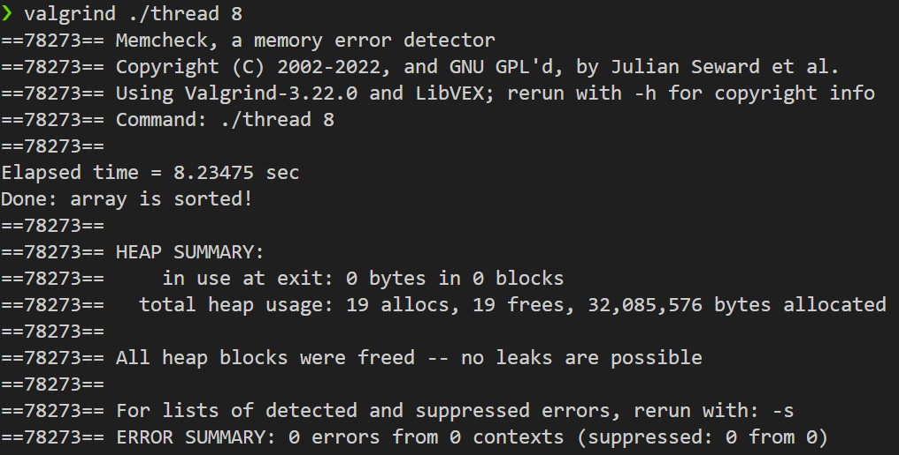

# HW3: Parallel Merge Sort using std::thread

## 1. 문제 정의 (Problem Definition)

본 프로젝트는 4백만 개의 정수(약 16MB)가 담긴 바이너리 데이터를 **Multi-threading**을 활용하여 병렬 정렬하는 것을 목표로 합니다.

표준 라이브러리의 정렬 함수(`std::sort` 등) 사용이 금지되어 있으며, 직접 **Merge Sort(합병 정렬)** 알고리즘을 구현하고 `std::thread`를 통해 작업을 분할하여, 스레드 개수 증가에 따른 수행 시간 단축(Performance Scaling)을 입증해야 합니다.

## 2. 구현 전략 (Implementation Strategy)

병렬 프로그래밍의 오버헤드를 최소화하고 성능을 극대화하기 위해 다음과 같은 전략을 수립했습니다.

1.  **Single Memory Allocation Strategy:**
    * 합병 정렬은 병합 과정에서 임시 버퍼가 필요합니다. 재귀 호출마다 버퍼를 생성/해제하면 막대한 성능 저하가 발생하므로, **최초 진입 시 전체 크기의 임시 버퍼를 단 한 번만 할당(`new T[]`)**하고 이를 모든 하위 스레드가 공유하도록 설계했습니다.
    * RAII 패턴을 적용하여 예외 발생 시에도 메모리가 안전하게 해제되도록 관리했습니다.
2.  **Parallel Divide and Conquer:**
    * 데이터 영역을 절반으로 나누어, 한쪽은 **새로운 스레드(`std::thread`)**에 위임하고 다른 한쪽은 **메인 스레드**가 처리하여 컨텍스트 스위칭 비용을 줄였습니다.
    * `join()`을 통해 동기화를 수행한 뒤, 두 정렬된 영역을 병합(`merge`)했습니다.
3.  **Threshold Optimization:**
    * 스레드 개수가 1개 이하로 떨어지거나 분할된 데이터 크기가 작을 경우, 불필요한 스레드 생성을 막기 위해 즉시 **Serial Merge Sort**로 전환했습니다.

## 3. 결과 (Results)

4백만 개의 정수 정렬 테스트 결과, 스레드 개수가 증가함에 따라 처리 시간이 획기적으로 단축되었습니다.

### 3.1 성능 측정 결과 (Performance Scaling)

| 스레드 수 (Threads) | 소요 시간 (Elapsed Time) | 가속 효과 (Speedup) |
| :---: | :---: | :--- |
| [**1**](images/image-hw3-01.png) | **678.55 msec** | Baseline |
| [**2**](images/image-hw3-02.png) | **341.13 msec** | ~1.99x (Ideal) |
| [**4**](images/image-hw3-03.png) | **219.38 msec** | ~3.09x |
| [**8**](images/image-hw3-04.png) | **145.22 msec** | ~4.67x |
| [**16**](images/image-hw3-05.png) | **120.88 msec** | ~5.61x |

> *Note: 하드웨어 코어 수의 물리적 한계 및 메모리 대역폭 병목으로 인해 8-Thread 이후부터는 성능 향상 폭이 감소하는 경향을 보입니다.*

### 3.2 메모리 안정성 검증 (Memory Verification)

수동으로 관리되는 대용량 임시 버퍼의 안전성을 확인하기 위해 Valgrind 검증을 수행했으며, **Memory Leak 0**를 달성했습니다.

## 4. 기술적 성과 (Technical Accomplishment)

* **Parallel Algorithm Design:** 분할 정복 알고리즘을 멀티스레드 환경에 맞게 재설계하여 선형에 가까운 성능 가속을 이끌어냈습니다.
* **Memory Optimization:** 재귀 호출 구조에서의 메모리 할당 오버헤드를 분석하고, **사전 할당(Pre-allocation)** 기법을 통해 성능 저하 요인을 제거했습니다.
* **Resource Management:** `std::thread`의 생명주기와 동적 메모리를 정교하게 제어하여, 대용량 데이터 처리 중에도 세그멘테이션 폴트나 메모리 누수가 발생하지 않는 견고한 코드를 완성했습니다.