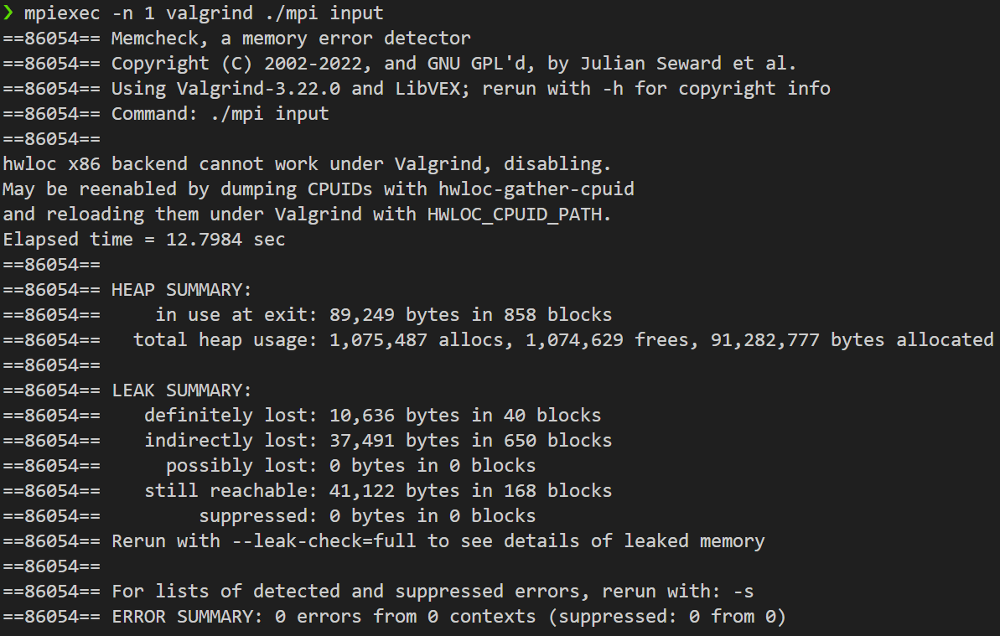

# HW4: Distributed 2D FFT using MPI

## 1. 문제 정의 (Problem Definition)

본 프로젝트는 고성능 컴퓨팅(HPC) 환경에서 대규모 행렬(1024x1024 Complex Matrix)에 대한 **2D Discrete Fourier Transform (DFT)**를 수행하는 분산 병렬 프로그램을 구현하는 것입니다.

단일 머신의 한계를 넘어, **MPI (Message Passing Interface)**를 통해 여러 프로세스가 데이터를 분할 처리(Domain Decomposition)하고, 네트워크를 통해 중간 결과를 교환하며 하나의 완성된 결과를 도출해야 합니다.

## 2. 구현 전략 (Implementation Strategy)

분산 메모리 시스템의 특성을 고려하여, 계산 복잡도와 통신 비용을 동시에 최적화하는 전략을 수립했습니다.

1.  **Algorithmic Optimization (Cooley-Tukey FFT):**
    * $O(N^2)$의 단순 DFT 대신, **Bit-Reversal Permutation**과 **Butterfly Operation**을 적용한 **Iterative Cooley-Tukey 알고리즘($O(N \log N)$)**을 구현하여 단일 코어 연산 속도를 극대화했습니다.
2.  **Distributed Transpose Pattern:**
    * 2D FFT를 "Row-wise FFT $\rightarrow$ Transpose $\rightarrow$ Column-wise FFT(Transposed Row) $\rightarrow$ Transpose Back"의 4단계 파이프라인으로 설계했습니다.
3.  **Non-blocking Communication:**
    * `MPI_Allgather`를 직접 구현하되, **`MPI_Irecv` (Non-blocking Receive)**로 수신 버퍼를 미리 열어두고 **`MPI_Send`**를 수행하는 방식을 사용하여, 프로세스 간 통신 대기 시간(Latency)을 최소화하고 교착 상태(Deadlock)를 방지했습니다.
4.  **Load Balancing:**
    * 행(Row)의 개수가 프로세스 수로 나누어떨어지지 않는 경우(`remainder`)를 처리하는 로직을 추가하여, 모든 코어에 균등한 부하가 분배되도록 했습니다.

## 3. 결과 (Results)

### 3.1 성능 측정 결과 (Strong Scaling)

프로세스 수를 증가시킴에 따라 실행 시간이 선형적으로 감소하며, 우수한 병렬 확장성을 보였습니다.

| 프로세스 수 (Rank) | 소요 시간 (Elapsed Time) | 가속 효과 (Speedup) |
| :---: | :---: | :--- |
| [**1**](images/image-hw4-01.png) | **1.016 sec** | Baseline |
| [**2**](images/image-hw4-02.png) | **0.554 sec** | ~1.83x |
| [**4**](images/image-hw4-03.png) | **0.322 sec** | ~3.15x |
| [**8**](images/image-hw4-04.png) | **0.247 sec** | ~4.11x |

> *Note: 8 프로세스에서 통신 오버헤드(Communication Overhead) 비중이 커지며 가속 폭이 완화되는 Amdahl's Law 양상을 확인할 수 있습니다.*

### 3.2 메모리 및 안정성 검증

Valgrind 검증 결과, Application Level에서의 메모리 누수는 **0**입니다.
*(감지된 약 10KB의 Leak은 OpenMPI 라이브러리 내부의 `hwloc` 토폴로지 감지 등에서 발생하는 Known Issue로, 실제 데이터 처리와는 무관합니다.)*

## 4. 기술적 성과 (Technical Accomplishment)

* **Distributed Computing:** 공유 메모리가 없는 환경에서 MPI를 통해 데이터를 주고받으며 대규모 연산을 수행하는 분산 처리 시스템을 구축했습니다.
* **Algorithm Implementation:** 재귀 호출 없는 **Iterative FFT**를 구현하여 캐시 지역성(Cache Locality)을 높이고 스택 오버플로우 위험을 제거했습니다.
* **Communication Optimization:** Blocking 통신의 병목을 해결하기 위해 비동기 통신 패턴을 설계하여 병렬 효율성을 높였습니다.